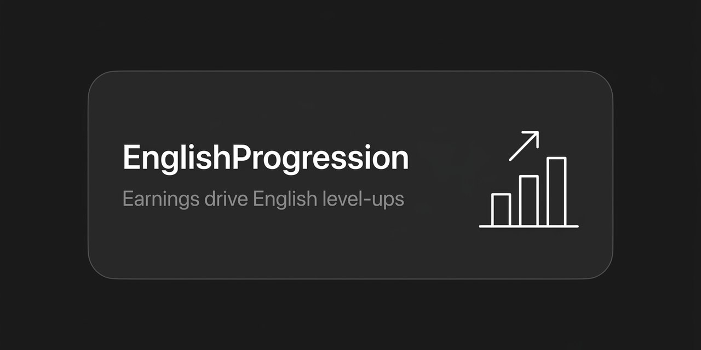

# EnglishProgression

[](LICENSE)
[](https://papermc.io/downloads/paper)
[](https://www.spigotmc.org/resources/vault.34315/)

Turns lifetime earnings into English level-ups. The plugin tracks how much
money a player has earned in total (not spent, earned), compares it against
per-level thresholds, and promotes the player along a LuckPerms track when
they cross a threshold. Each level also raises the earnings multiplier, so
better English earns faster.

<p align="center">
  
</p>

Part of a four-plugin ESL family: [Chat2Earn](https://github.com/itsfedor/chat2earn) · [EnglishProgression](https://github.com/itsfedor/englishprogression) · [VocabQuiz](https://github.com/itsfedor/vocabquiz) · [DailyEnglish](https://github.com/itsfedor/dailyenglish)

## Why this plugin exists

Levels that only a teacher can grant feel arbitrary. Levels that come from
money you earned by actually speaking English feel earned. This plugin makes
the ladder automatic: chat, earn, promote.

## Level thresholds

| Level | Lifetime earnings | Multiplier |
|---|---|---|
| A0 | start | ×1 |
| A1 | $100 | ×2 |
| A2 | $1,000 | ×3 |
| B1 | $10,000 | ×4 |
| B2 | $50,000 | ×5 |
| C1 | $200,000 | ×5 |
| C2 | $500,000 | ×5 |
| D1 | $1,000,000 | ×5 |

The multiplier applies to whatever the economy pays the player. Reaching D1
takes a million dollars of lifetime earnings, which on a real server is
months of daily English.

## Requirements

- Paper or Spigot 1.21+
- [Vault](https://www.spigotmc.org/resources/vault.34315/) + an economy plugin (e.g. [EssentialsX](https://essentialsx.net/downloads.html))
- [LuckPerms](https://luckperms.net/) (the plugin promotes on a track)

## Install

1. Download `EnglishProgression.jar` from [Releases](https://github.com/itsfedor/englishprogression/releases/latest) (or use the copy in the repo root).
2. Drop the jar into `plugins/`.
3. Create the LuckPerms track named `english` with groups in order:
   `a0 a1 a2 b1 b2 c1 c2 d1`.
4. Copy `config.example.yml` to `config.yml` in the plugin folder.
5. Restart the server.

## Build from source

```bash
./gradlew build
```

Requires JDK 21. The build pulls Paper API 1.21.1, VaultAPI and the LuckPerms
API, and produces `build/libs/EnglishProgression.jar`.

On level-up the plugin promotes the player and sends a level-up message
with the new multiplier. The messages are configurable with color codes.

## Configuration

```yaml
multipliers:
  a0: 1.0
  a1: 2.0
  a2: 3.0
  b1: 4.0
  b2: 5.0
  c1: 5.0
  c2: 5.0
  d1: 5.0

thresholds:
  a1: 100.0
  a2: 1000.0
  b1: 10000.0
  b2: 50000.0
  c1: 200000.0
  c2: 500000.0
  d1: 1000000.0

luckperms:
  track: "english"
  promote-on-levelup: true
```

## Troubleshooting

- **No promotion on level-up** — the `english` track must exist before the plugin loads it: `/lp createtrack english`, then add the groups in order. Verify with `/lp track english info`. The plugin never creates its own groups.
- **Nothing pays out** — Vault alone is not enough; an economy plugin (EssentialsX, CMI…) must be installed and registered, or Vault has no economy provider.
- **Earnings never grow** — this plugin only *reads* lifetime earnings. Something else must pay players for English ([Chat2Earn](https://github.com/itsfedor/chat2earn) was built to do exactly that).

## Pair it with

[Chat2Earn](https://github.com/itsfedor/chat2earn), which pays players for
speaking English and feeds this plugin's earnings counter. The two were
designed as a pair.

## License

MIT. See [LICENSE](LICENSE).
